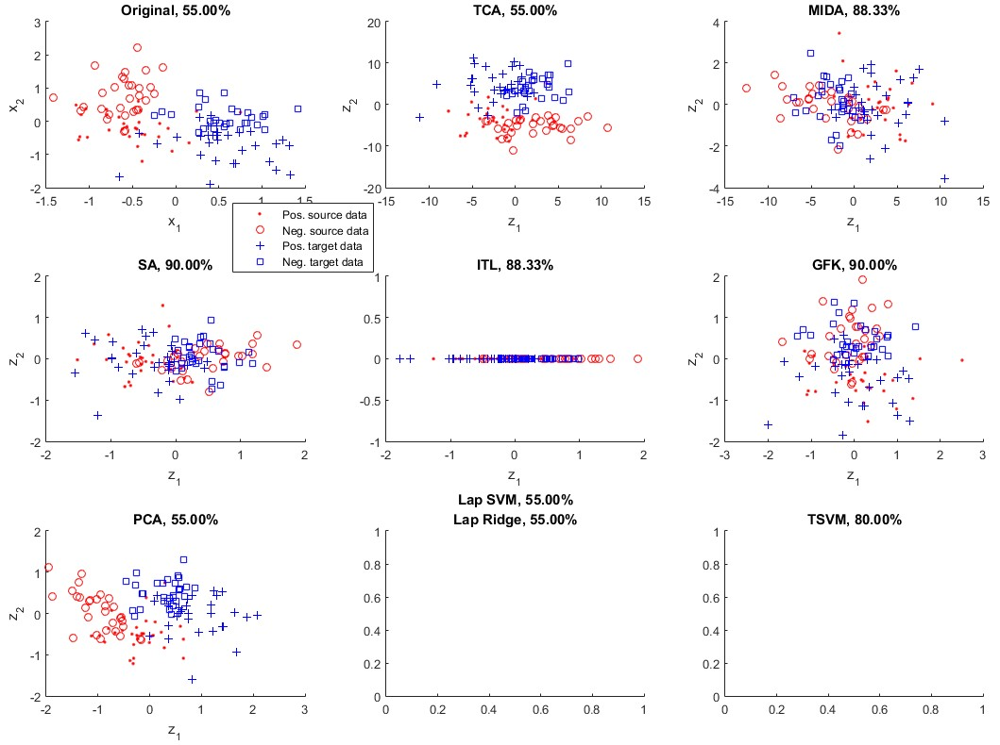
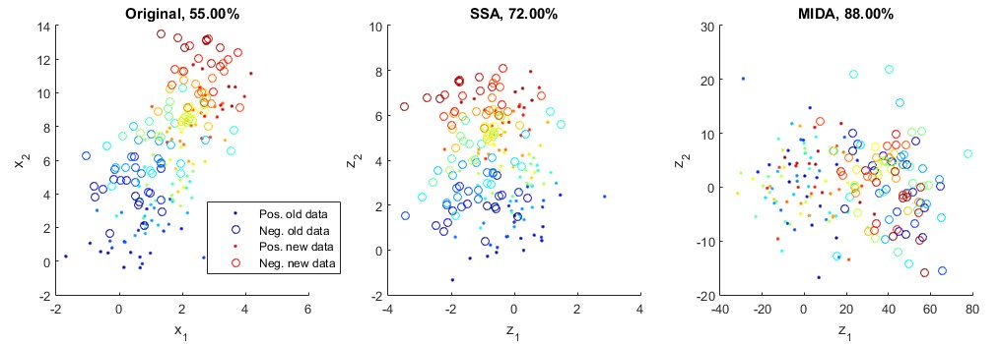

# domain-adaptation-toolbox

Wrappers and implementions of several domain adaptation / transfer learning / semi-supervised learning algorithms, in matlab.

Please find sample usages in showSimExp.m. The SSA algorithm needs a dependency (http://mloss.org/revision/download/851/) which is not included in this toolbox.

The domain adaptation algorithms include:

* Transfer Component Analysis (TCA)
* Maximum Independence Domain Adaptation (MIDA)
* Subspace Alignment (SA)
* Information-Theoretical Learning (ITL)
* Geodesic flow kernel (GFK)
* Stationary Subspace Analysis (SSA)

For comparison, we also included three semi-supervised (transductive) learning algorithms, which can be used as baselines to other domain adaptation methods:

* Laplacian SVM (LapSVM)
* Laplacian ridge regression (LapRR)
* Transducive SVM (TSVM)

The PCA and kernel PCA algorithm can also be a baseline method. So, there are 10 algorithms in this toolbox. Among them, TCA, MIDA, SA, (kernel) PCA, and LapRR are self-implemented. ITL, GFK, SSA, LapSVM, and TSVM are wrappers of existing toolboxes. These toolboxes are included in the project, except SSA, which is too big and can be downloaded from the link provided below. The interfaces of the functions have been unified for convenience. We hope the work can be helpful for domain adaptation / transfer learning researchers.

Dependencies:

1. ITL: I downloaded it from somewhere I can't find it now.
1. GFK: http://www-scf.usc.edu/~boqinggo/
1. GFK: plslda, http://www.mathworks.com/matlabcentral/fileexchange/47767-libpls-1-95-zip/
1. SSA: http://mloss.org/revision/download/851/
1. LapSVM: https://github.com/tknandu/LapTwinSVM/tree/master/Primal_LapSVM/lapsvmp_v02
1. TSVM: http://svmlight.joachims.org/ and https://github.com/sods/svml

References:

1. TCA: S. J. Pan, I. W. Tsang, J. T. Kwok, and Q. Yang, "Domain adaptation	via transfer component analysis," Neural Networks, IEEE Trans, 2011
1. MIDA:  Ke Yan, Lu Kou, and David Zhang, "Domain Adaptation via Maximum Independence of Domain Features," http://arxiv.org/abs/1603.04535
1. SA: B. Fernando, A. Habrard, M. Sebban, and T. Tuytelaars, "Unsupervised visual domain adaptation using subspace alignment," in ICCV, 2013
1. ITL: Y. Shi and F. Sha, "Information-theoretical learning of discriminative clusters for unsupervised domain adaptation," in ICML, 2012
1. GFK: B. Gong, Y. Shi, F. Sha, and K. Grauman, "Geodesic flow kernel for unsupervised domain adaptation," in CVPR, 2012
1. SSA: P. Von Bunau, et al, "Finding stationary subspaces in multivariate time series," Physical review letters, 2009
1. LapSVM and LapRR: M. Belkin, P. Niyogi, and V. Sindhwani, "Manifold regularization: A geometric framework for learning from labeled and unlabeled examples," J. Mach. Learn. Res., 2006.
1. TSVM: T. Joachims, "Transductive inference for text classification using support vector machines," 1999